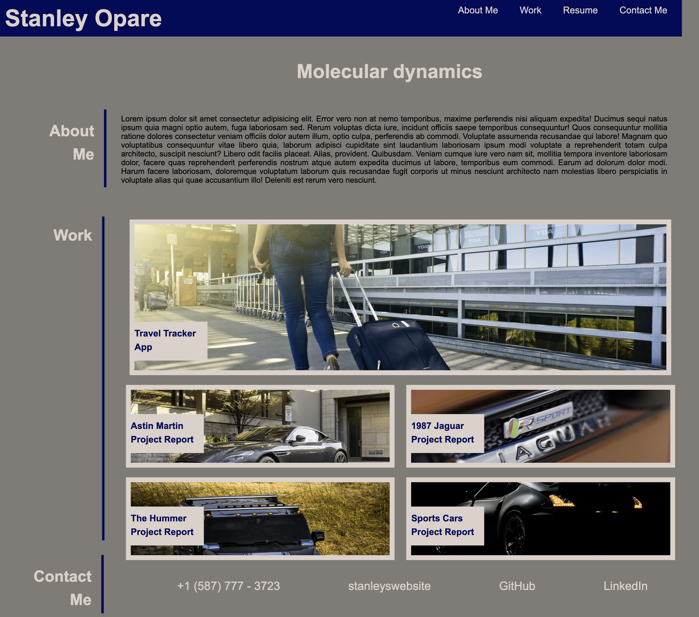

# Building a Portfolio to Showcase Talents to Employers

## Description
As a webdeveloper showing my portfolio of deployed web applications and webpages is a great tool to advertise my expertise to potential employers. This is also a minimum requirement for a webdeveloper. In this project i utitilise my recently learned skills such as flexbox, media querries, HTML and CSS to setup a website that displays my portfolio.

## Acceptance
The follwing acceptance criteria was adopted from https://git.bootcampcontent.com/University-of-Toronto/UTOR-VIRT-FSF-PT-05-2023-U-LOLC/-/tree/main/02-Advanced-CSS/02-Challenge. 

GIVEN I need to sample a potential employee's previous work
WHEN I load their portfolio
THEN I am presented with the developer's name, a recent photo or avatar, and links to sections about them, their work, and how to contact them
WHEN I click one of the links in the navigation
THEN the UI scrolls to the corresponding section
WHEN I click on the link to the section about their work
THEN the UI scrolls to a section with titled images of the developer's applications
WHEN I am presented with the developer's first application
THEN that application's image should be larger in size than the others
WHEN I click on the images of the applications
THEN I am taken to that deployed application
WHEN I resize the page or view the site on various screens and devices
THEN I am presented with a responsive layout that adapts to my viewport

## Method
A github repository was created for the project and cloned to my remote workspace. Initailly, an index.html, style.css, and relevant images were downloaded and kept in their correct folders. Stratign from scratch the structure to the webpage was built in index.html and with a linked styles.css file, the webpages was styled to make it presentable and accessible on computer screens through tablet screens to mobile phone screens.

The GitHub repository can be found at https://github.com/StanOp09/Project2

The live website is hosted at https://stanop09.github.io/Portfolio/

## Appearance and Web Functionality

## Credits
Sean Roshan

https://www.pexels.com/ (Accessed 12th June 2023)
